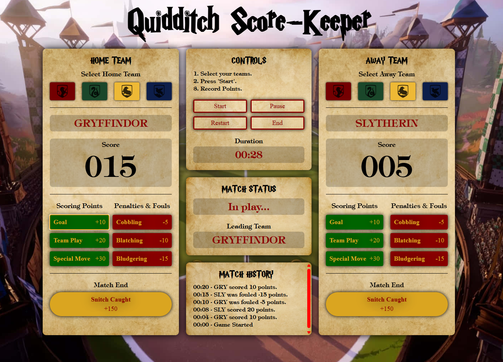

# Quidditch Score-Keeper

**About**  
The original brief for this project was to create a basketball score counter. As I don't really know anything about basketball and to push myself in what I had leant. I instead created a harry potter inspired quidditch score keeper. 

The brief for the project was to:  
- Create the counter from scratch.
- Follow the design... oops.
- Make all 6 (add points) buttons work.

The stretch goals were:
- Add a 'New Game' button.
- Highlight the leader.
- Add a few more counters (period, fouls, timer).
- Change the design.

## Features
**Standard**
- Increment the displayed counter by the respective number of points for each team.
  
**Addtional** (features of original scope)  
- Additonal buttons to decrement the displayed counter by the respective number of points for each team.
- Team selector buttons for home and away teams (removed ability to be able to select the same team on each side).
- Current team displayed.
- Game control buttons: 'New Game', 'Pause', 'Restart' & 'End'.
- Above controls also update displayed game status and control the timer.
- Game timer.
- History of game events added that logs the current time, current team and acitivy.
- Displays the leading team (most points) or 'TIE'.
- End game button (for catching the snitch) that adds points and ends the game.
- Custom styling.

## Course Details
**Course:** Scrimba Frontend Path  
**Module:** Web dev basics  
**Unit:** Solo Project (PRO) - Basketball Scoreboard

## Built With
- HTML  
- CSS  
- JavaScript  

## Live Demo
[Check it out here](https://quidditch-score-keeper.netlify.app/)
